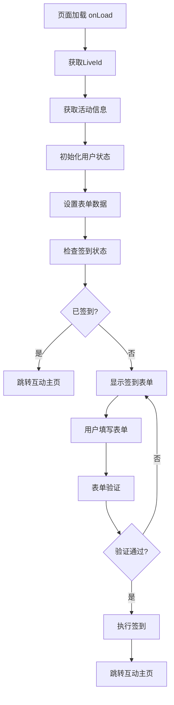

# JoymewIndex 模块架构分析

## 1. 模块概述

JoymewIndex 是嗨喵悦动小程序的核心签到页面模块，承担着活动入口的重要角色。该模块支持多种活动场景（婚礼、企业版、生日派对等），为用户提供个性化的签到体验，并将用户引导至互动主页。

## 2. 技术架构

### 2.1 整体架构
```
joymewIndex/
├── joymewIndex.js      # 主逻辑文件
├── joymewIndex.json    # 页面配置
├── joymewIndex.wxml    # 页面结构
├── joymewIndex.wxss    # 主样式文件
└── styles/             # 场景样式目录
    ├── wedding.wxss    # 婚礼版样式
    ├── enterprise.wxss # 企业版样式
    ├── birth.wxss      # 生日版样式
    └── ...             # 其他场景样式
```

### 2.2 技术栈
- **前端框架**: 微信小程序原生框架
- **样式预处理器**: WXSS (微信小程序样式语言)
- **组件化**: 私有组件 (privacyAuthorize, imageCropper)
- **构建工具**: 微信开发者工具

## 3. 核心功能架构

### 3.1 数据流设计



### 3.2 LiveId 获取机制
模块实现了多层级的LiveId获取策略，优先级如下：
1. **二维码扫描** - 从URL参数中解析liveId或userId
2. **分享参数** - 从分享链接中获取liveId
3. **审核模式** - 审核环境下的特殊liveId
4. **本地缓存** - 用户之前访问过的活动liveId

```javascript
// LiveId获取优先级逻辑
if (userId) {
    // 通过userId换取liveId
    liveIdLast = await reqGetLiveIdByUserId(userId);
} else if (liveId) {
    // 直接使用liveId
    liveIdLast = liveId;
} else if (sharedLiveId) {
    // 使用分享参数中的liveId
    liveIdLast = sharedLiveId;
} else if (examineLiveId) {
    // 使用审核模式的liveId
    liveIdLast = examineLiveId;
} else if (stLiveId) {
    // 使用缓存中的liveId
    liveIdLast = stLiveId;
}
```

## 4. 业务架构

### 4.1 多场景支持
模块通过 `sceneInfo` 配置支持16种不同的活动场景：

| 场景ID | 场景名称 | 别名 | 适用场景 |
|--------|----------|------|----------|
| 0 | 婚礼版 | wedding | 婚礼庆祝 |
| 91 | 婚礼版 | zshl | 特殊婚礼 |
| 1 | 企业版 | enterprise | 企业活动 |
| 2 | 生日版 | birth | 生日庆祝 |
| 21 | 宝宝宴 | bby | 婴儿庆祝 |
| 22 | 寿宴 | sy | 长者寿辰 |
| 23 | 成人礼 | crl | 成人仪式 |
| 41 | 毕业典礼 | bydl | 学校毕业 |
| 51 | 同学会 | txh | 同学聚会 |
| ... | ... | ... | ... |

### 4.2 表单架构
```javascript
signForm: {
    splid: "",           // 活动ID
    avator: "",          // 用户头像
    wx_name: "",         // 微信昵称
    bless_str: "",       // 祝福语
    type: "",            // 身份类型
    phonenumber: "",     // 手机号
}
```

### 4.3 签到流程架构

#### 4.3.1 两种签到模式
1. **正常签到** - 完整表单信息签到
2. **服务端签到** - 缺少头像/昵称时的代理签到

#### 4.3.2 表单验证机制
- **头像验证**: 自定义头像模式下必填
- **昵称验证**: 自定义昵称模式下必填  
- **祝福语验证**: 所有模式必填
- **手机号验证**: 强制手机号模式下必填且格式验证

## 5. 样式架构

### 5.1 样式组织方式
采用**主样式文件 + 场景样式文件**的组合方式：

```css
/* joymewIndex.wxss */
@import "./styles/wedding.wxss";
@import "./styles/enterprise.wxss"; 
@import "./styles/birth.wxss";
/* ... 其他场景样式 ... */

/* 签到公共样式 */
.joymewIndex { /* 公共样式 */ }
.signWrap { /* 公共样式 */ }
```

### 5.2 动态样式系统
```xml
<!-- WXML中的动态类名 -->
<view class="signWrap {{sceneAlias}} {{customSignBg ? 'customSignBg' : ''}}">
    <view class="bg">
        <image src="{{customSignBg}}" class="customBg" wx:if="{{customSignBg}}"></image>
    </view>
</view>
```

### 5.3 样式特性
- **响应式背景**: 支持自定义背景图片
- **主题色彩**: 不同场景使用不同色彩主题
- **组件化样式**: 各场景样式相互独立

## 6. 组件架构

### 6.1 外部组件依赖
- **privacyAuthorize** - 隐私授权组件
- **imageCropper** - 头像裁剪组件

### 6.2 组件通信
通过小程序的事件机制实现组件间通信：
```javascript
// 头像裁剪组件事件处理
onConfirmCropper(e) {
    const avatarCropped = e.detail;
    // 上传并更新头像
}
```

## 7. 数据管理架构

### 7.1 全局状态集成
模块与应用的全局状态管理深度集成：

```javascript
// 与全局状态的交互
app.splidInfo_setSplidInfo({ /* 活动信息 */ });
app.userInfo_setuserInfo({ /* 用户信息 */ });
app.siyiInfo_setSiyiInfo({ /* 司仪信息 */ });
```

### 7.2 本地存储策略
- **liveId缓存**: 存储用户访问的活动ID
- **用户信息**: 头像、昵称、手机号等
- **签到状态**: 避免重复签到

## 8. API架构

### 8.1 核心接口
```javascript
// 主要API接口
reqGetLiveInfo(splid)          // 获取活动信息
reqSign(formData)              // 执行签到
reqGetSignStatus(splid)        // 获取签到状态
reqSaveSignInfo(params)        // 暂存签到信息
reqGetPhone({code, type})      // 获取手机号
```

### 8.2 错误处理机制
- **网络错误**: 显示友好提示信息
- **业务错误**: 根据错误码执行相应处理
- **授权错误**: 自动触发重新授权流程

## 9. 性能优化架构

### 9.1 加载优化
- **异步初始化**: LiveId获取和活动信息获取异步执行
- **缓存策略**: 有效利用本地缓存减少网络请求
- **懒加载**: 样式文件按需导入

### 9.2 交互优化
- **防抖处理**: 表单输入防抖优化
- **延迟执行**: 适使用 timeoutTask 优化用户体验
- **渐进增强**: 核心功能优先，增强功能渐进加载

## 10. 安全架构

### 10.1 数据验证
- **前端验证**: 表单数据格式验证
- **参数过滤**: 使用 filterObj 过滤空值参数
- **URL验证**: isHttpUrl 验证背景图片URL合法性

### 10.2 权限控制
- **微信授权**: 集成微信授权登录体系
- **活动权限**: 基于liveId的活动权限验证
- **审核模式**: 独立的审核环境处理逻辑

## 11. 扩展性设计

### 11.1 配置化驱动
- **场景配置**: 通过sceneInfo配置支持新场景
- **样式主题**: 通过样式文件支持新主题
- **业务规则**: 通过配置项控制业务逻辑

### 11.2 模块化设计
- **工具函数**: 独立的utils模块
- **API封装**: 统一的API调用层
- **常量定义**: 集中的常量配置文件

## 12. 总结

JoymewIndex模块采用了清晰的分层架构设计，具备以下特点：

1. **高内聚低耦合**: 各功能模块职责明确，相互依赖最小化
2. **配置化驱动**: 通过配置文件支持多场景扩展
3. **组件化复用**: 公共组件提高代码复用性
4. **性能优化**: 多层次的性能优化策略
5. **安全可靠**: 完善的数据验证和错误处理机制

该模块为嗨喵悦动小程序提供了稳定、可扩展的签到服务基础，是整个应用生态的重要入口节点。